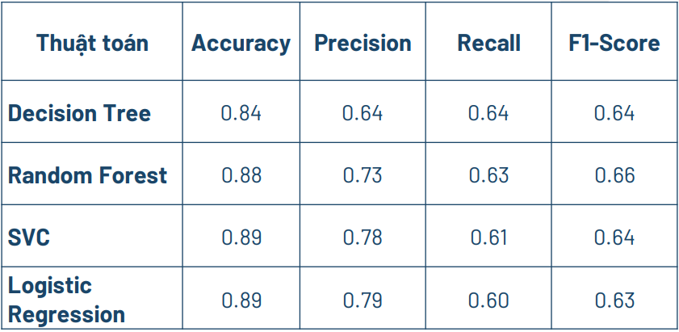
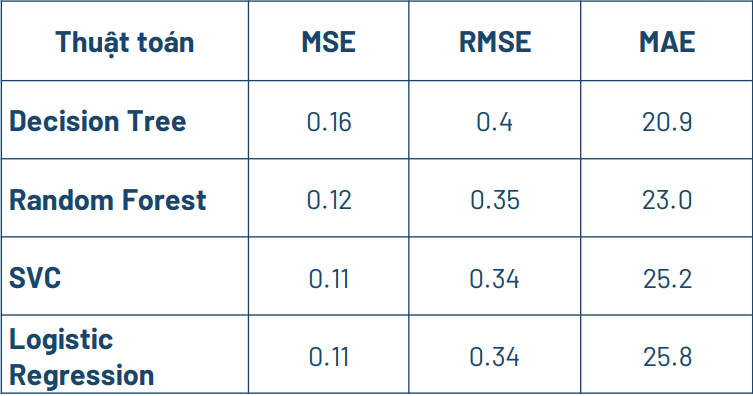

# ANALYSIS-AND-FORECAST-FOR-SUCCESS-MARKETING-STRATEGY-PHONE

## Đánh Giá Mô Hình

## Ưu điểm
| Decision Tree                                                                                                                          |                                              Random forest                                             | SVC                                                                                                                                                                                  | Logistic regresstion                                                                                                                                              |
|----------------------------------------------------------------------------------------------------------------------------------------|:------------------------------------------------------------------------------------------------------:|--------------------------------------------------------------------------------------------------------------------------------------------------------------------------------------|-------------------------------------------------------------------------------------------------------------------------------------------------------------------|
| Mô hình đơn giản. Cần ít dữ liệu để huấn luyện,phân lớp nhanh Trong bài toán này, thuật toán xử lý nhanh như không có độ chính xác cao | Độ chính xác cao. Không bị overfitting. Trong bài toán này, thuật toán cho ra kết quả chính xác hơn DT | Xử lý trên không gian số chiều cao. Tiết kiệm bộ nhớ. Tính linh hoạt cao. Cho ra kết quả chính xác cao trên tập dữ liệu lớn. Trong bài toán này, SVC cho ra kết qảu dự đoán khá cao. | Giảm thiểu rủi ro overfitting. Dễ dàng cập nhật thêm dữ liệu mà không ảnh hưởng lớn đến bài toán đã xử lý. Trong bài toán này, LR cho ra kết quả dự đoán khá cao. |               |
## Nhược Điểm
| Decision Tree                                                                                |                                              Random forest                                             | SVC                        | Logistic regresstion                                                          |
|----------------------------------------------------------------------------------------------|:------------------------------------------------------------------------------------------------------:|----------------------------|-------------------------------------------------------------------------------|
| Không đảm bảo xây dựng được cây tối ưu. Dễ bị overfitting. Ưu tiên thuộc tính nhiều giá trị. | Độ chính xác cao. Không bị overfitting. Trong bài toán này, thuật toán cho ra kết quả chính xác hơn DT | Thời gian xử lý rất chậm.  | Xử lý kém chính xác trên dữ liệu có nhiều ranh giới phân loại hoặc phi tuyến. |
